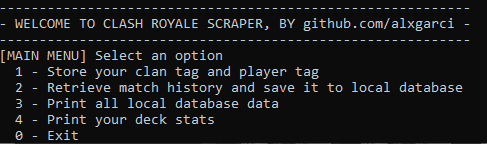
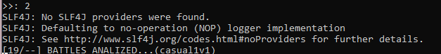
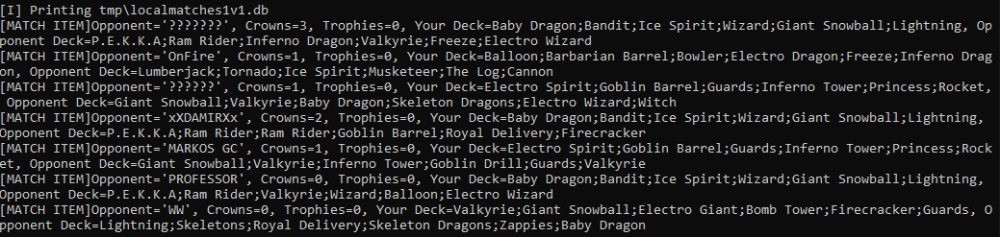
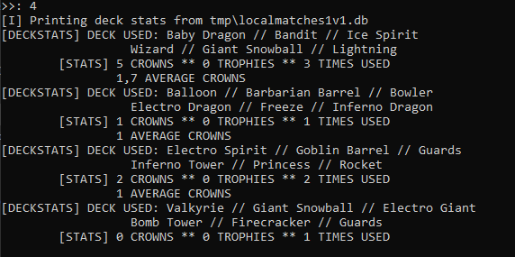

# Clash Royale Database - Battle Analyzer

- [Introduction](#introduction)
- [Features](#features)
- [Use](#use)
    - [Retrieve recent match history](#retrieve-recent-match-history)
    - [Printing the database](#printing-the-database)
    - [Printing the database](#printing-the-database)
    - [Getting some stats](#getting-some-stats)
- [Requirements](#requirements)
- [Used libraries](#used-libraries)


## Introduction

This is a proyect to show the potential of Java in use of [jcrapi2 wrapper](https://github.com/mlieshoff/jcrapi2).
It's a simple java proyect that downloads your entire battle history and stores the information
in a local 'db'. Every time you run the db writing, it adds on top, so you can have as much
stored battles as you wish.

With that information stored, in the app its shown metrics related to your perform, crown average
and the decks that give you the best results.


## Features

- Form your local battle database from your recent matches
- Get metrics on all your battles stored in the database
- More to add . . . (Accepting suggestions)

## Use

The menu just goes by an Integer input to select the option. If there are any Player and 
Clan Tag stored in the .properties, it will be loaded on start.

To input the tags, just add them on the .properties manually or add it on the option '1'



### Retrieve recent match history

This method creates a local file to store recent matches played on the previous
'#00000' player.


```
GetPlayerBattleLogResponse getPlayerBattleLogResponse = api.getPlayerBattleLog(
GetPlayerBattleLogRequest.builder(clanTag).playerTag(playerTag)
.build());
```

It retrieves the matches using the method from jcrapi2 previously mentioned, and converting
it to get only the wanted information



### Printing the database

Database is stored on *PROYECTFOLDER/tmp/***.db*, can be read during execution



### Getting some stats

By watching the whole locally stored database, we can get our most used decks,
average crowns and trophies by deck (***more coming soon...***). Some basic stats.



## Requirements

- Java JDK or JRE
- Downloading last [executable .jar](https://github.com/alxgarci/ClashRoyale_Database_BattleAnalyzer/releases/latest)
- In cmd/console:

  ```
  java -jar EXECUTABLE_NAME.jar
  ```


## Used libraries

- Using [jcrapi2 wrapper](https://github.com/mlieshoff/jcrapi2), a Clash Royale API wrapper for Java by [mlieshoff](https://github.com/mlieshoff).
- Using [Maven](https://maven.apache.org/) to manage resources, plugins and JAR building.
